Container image for ethtool - the primary means in Linux kernel-based operating systems (primarily Linux and Android) for displaying and modifying the parameters of network interface controllers (NICs) and their associated device driver software.

## Usage

### List info for interface named eth0

```shell
docker run --rm -it --network=host ghcr.io/r-xs-fi/ethtool eth0
```

Outputs:
```console
Settings for eth0:
	Supported ports: [ TP	 MII ]
	Supported link modes:   10baseT/Half 10baseT/Full
	                        100baseT/Half 100baseT/Full
	                        1000baseT/Full
	Supported pause frame use: Symmetric Receive-only
	Supports auto-negotiation: Yes
	Supported FEC modes: Not reported
	Advertised link modes:  10baseT/Half 10baseT/Full
	                        100baseT/Half 100baseT/Full
	                        1000baseT/Full
	Advertised pause frame use: Symmetric Receive-only
	Advertised auto-negotiation: Yes
	Advertised FEC modes: Not reported
	Link partner advertised link modes:  10baseT/Half 10baseT/Full
	                                     100baseT/Half 100baseT/Full
	                                     1000baseT/Full
	Link partner advertised pause frame use: No
	Link partner advertised auto-negotiation: Yes
	Link partner advertised FEC modes: Not reported
	Speed: 1000Mb/s
	Duplex: Full
	Auto-negotiation: on
	master-slave cfg: preferred slave
	master-slave status: slave
	Port: Twisted Pair
	PHYAD: 0
	Transceiver: external
	MDI-X: Unknown
	Supports Wake-on: pumbg
	Wake-on: d
	Link detected: yes
```

## Supported platforms


| OS    | Architecture  | Supported | Example hardware |
|-------|---------------|-----------|-------------|
| Linux | amd64 | ✅       | Regular PCs (also known as x64-64) |
| Linux | arm64 | ✅       | Raspberry Pi with 64-bit OS, other single-board computers, Apple M1 etc. |
| Linux | arm/v7 | ✅       | Raspberry Pi with 32-bit OS, older phones |
| Linux | riscv64 | ✅       | More exotic hardware |

## How does this software get to me?

```mermaid
flowchart TD
    subgraph "Origin"
        sourcerepo["Original source repo"]
    end
    subgraph "Alpine infrastructure"
        Alpine_build[Alpine build machine]
        Alpine_package[Alpine package registry: ethtool 🔗]

        click Alpine_package "https://pkgs.alpinelinux.org/package/edge/community/x86/ethtool"
    end
    subgraph "Packaging build"
        rxsfi_build["r.xs.fi build (GitHub Actions)"]
    end
    subgraph "Container Registry"
        r_xs_fi_package_registry[ghcr.io/r-xs-fi/ethtool 🔗]

        click r_xs_fi_package_registry "https://ghcr.io/r-xs-fi/ethtool"
    end
    subgraph "user"
        docker_run[$ docker run ...]
    end
    sourcerepo -- downloads --> Alpine_build -- stores --> Alpine_package
    Alpine_package -- download --> rxsfi_build
    rxsfi_build -- push --> r_xs_fi_package_registry
    r_xs_fi_package_registry -- pull --> docker_run[$ docker run ...]

```


